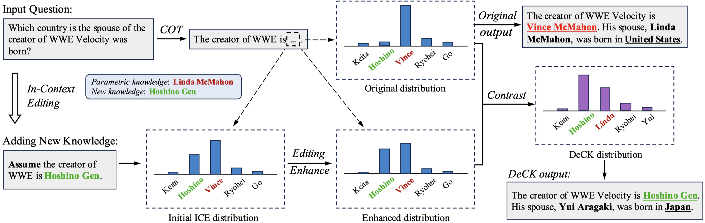

Decoding by Contrasting Knowledge (DeCK)
===

[](https://arxiv.org/abs/2405.11613)
[](https://github.com/huggingface/transformers)
[](https://x.com/Byron52238498/status/1792754220535620023)

Code for the paper "Decoding by Contrasting Knowledge: Enhancing LLMs’ Confidence on Edited Facts"

Paper: https://arxiv.org/abs/2405.11613  
Authors: [Baolong Bi](https://byronbbl.github.io/)$^{1,2}$, [Shenghua Liu](https://shenghua-liu.github.io/)$^{1,2}$, [Lingrui Mei](https://me.meirtz.com/about/)$^{1,2}$, [Yiwei Wang](https://wangywust.github.io/)$^{3}$, [pengliaj](https://scholar.google.com/citations?user=NEAhh3IAAAAJ&hl=en) $^{4}$, [Xueqi Cheng](https://people.ucas.ac.cn/~cxq?language=en)$^{1,2}$  
$^1$ CAS Key Laboratory of AI Safety, ICT, CAS, $^2$ University of Chinese Academy of Sciences, $^3$ University of California, Los Angeles, $^4$ Carnegie Mellon University

## Overview



The knowledge within large language models (LLMs) may become outdated quickly. While in-context editing (ICE) is currently the most effective method for knowledge editing (KE), it is constrained by the black-box modeling of LLMs and thus lacks interpretability. Our work aims to elucidate the superior performance of ICE in KE by analyzing the impacts of in-context new knowledge on token-wise distributions. We observe that despite a significant boost in logits of the new knowledge, the performance of ICE is still hindered by stubborn knowledge. Stubborn knowledge refers to facts that have gained excessive confidence during pretraining, making them hard to edit effectively. To address this issue and further enhance the performance of ICE, we propose a novel approach termed **De**coding by **C**ontrasting **K**nowledge (DeCK). DeCK derives the distribution of the next token by contrasting the logits obtained from the newly edited knowledge guided by ICE with those from the unedited parametric knowledge. Our experiments consistently demonstrate that DeCK enhances the confidence of LLMs in edited facts. For instance, it improves the performance of LLaMA3-8b-instruct on MQuAKE by up to 219%, demonstrating its capability to strengthen ICE in the editing of stubborn knowledge. 

DeCK can be easily integrated into any ICE method as a decoding component to enhance editing capabilities. Our work paves the way to develop both effective and accountable KE methods for LLMs.

## Setup

```
pip install -e transformers-4.28.1 # run LLaMA2 models
pip install -e transformers-4.40.2 # run LLaMA3, Mistral models
```

## Stubborn Knowledge

We provide *stubborn* dataset at the folder `MQuAKE/datasets/stubborn`

## Experiments

### Arguments

| Argument          | Example           | Description   |
| ----------------- | ----------------- | ------------- |
| `--model-name`    | `meta-llama/Llama-2-13b-chat-hf` | Specifies the model you want to use, currently we support LLaMA2, LLaMA3, Mistral and so on. |
| `--mode`          | `deck` | Option to run with `baseline`, `deck` or enhanced `deck_pro`. |
| `--data-path`     | `/path/to/dataset` | Path to the dataset file or folder. |
| `--num-gpus`      | `1` | Number of GPUs to use, `1/2/4/8` for `7B/13B/30B/65B` model sizes respectively.  |
| `--max_gpu_memory`| `27` | Maximum GPU memory size (in GiB) to allocate. Default: 27 (for 32G V100).  |
| `--batch_size`    | `1` or `full` | Batch size of edit memory means the number of instances providing the edited facts for knowledge retrieval.  |

### Run ICE
#### Batch size of edit memory = 1

```
python run_ice.py --model-name meta-llama/Llama-2-13b-chat-hf --mode deck --num-gpus 1 --batch_size 1
```

#### Full batch size of edit memory

```
python run_ice.py --model-name meta-llama/Llama-2-13b-chat-hf --mode deck --num-gpus 1 --batch_size full
```

### Run MeLLo

```
python run_mello.py --model-name meta-llama/Llama-2-13b-chat-hf --mode deck --num-gpus 1
```

## Bugs or Qustions?

If you have any questions related to the repo or the paper, or you encounter any problems when using the datasets/code, feel free to email Baolong Bi (bibaolong23z@ict.ac.cn) or open an issue!

## Citation

[](https://doi.org/10.48550/arXiv.2405.11613)

Please cite our paper if it's helpful to your work!
```
@misc{bi2024decoding,
      title={Decoding by Contrasting Knowledge: Enhancing LLMs' Confidence on Edited Facts}, 
      author={Baolong Bi and Shenghua Liu and Lingrui Mei and Yiwei Wang and Pengliang Ji and Xueqi Cheng},
      year={2024},
      eprint={2405.11613},
      archivePrefix={arXiv},
      primaryClass={cs.CL}
}
```
